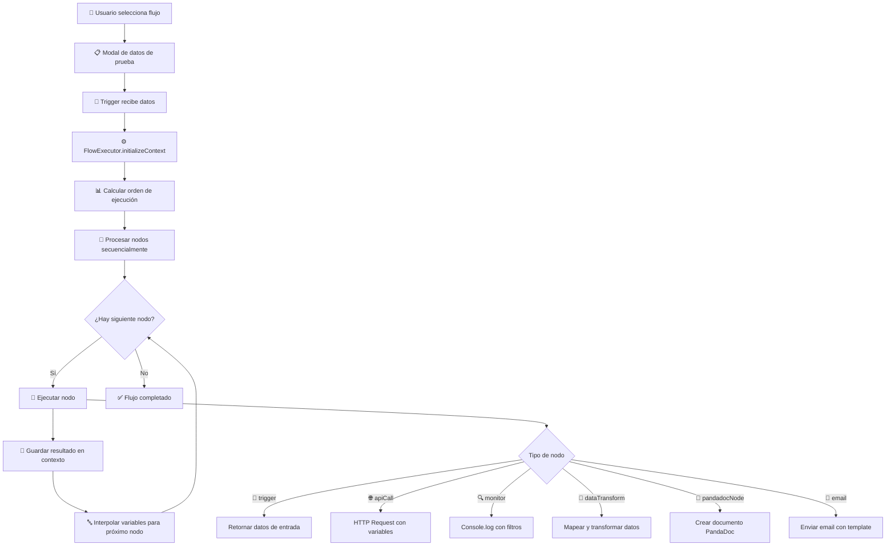

# 📖 Documentación CONEX - Sistema de Flujos de Automatización

## 🎯 Introducción

CONEX es un sistema de automatización visual que permite crear flujos de trabajo mediante nodos conectados. Similar a herramientas como Zapier o Microsoft Power Automate, pero integrado directamente en tu CRM.

**🆕 Nuevas características:**
- ✅ **Sistema de testing avanzado** con datos configurables
- ✅ **Modal de visualización JSON** para inspeccionar flujos
- ✅ **Ejecución real de flujos** en el editor
- ✅ **Modales de ayuda** en español para cada nodo
- ✅ **Arquitectura modular** escalable y mantenible

## 🏗️ Arquitectura General

```
┌─────────────────┐    ┌─────────────────┐    ┌─────────────────┐
│   FlowBuilder   │───▶│  FlowExecutor   │───▶│    Database     │
│   (Frontend)    │    │   (Backend)     │    │   (Firestore)   │
└─────────────────┘    └─────────────────┘    └─────────────────┘
         │                        │                        │
         ▼                        ▼                        ▼
┌─────────────────┐    ┌─────────────────┐    ┌─────────────────┐
│     Nodes       │    │   Execution     │    │     Flows       │
│  (Components)   │    │    Context      │    │   Metadata      │
└─────────────────┘    └─────────────────┘    └─────────────────┘
```

## 🚀 Características Principales del FlowBuilder

### **🎮 Interfaz de Usuario**
- **Editor visual** con drag & drop para nodos
- **Sidebar de nodos** disponibles para arrastrar
- **Panel de configuración** dinámico por tipo de nodo
- **Controles integrados** (zoom, minimap, grid)
- **Tema oscuro** consistente en toda la interfaz

### **🛠️ Herramientas de Desarrollo**
1. **🔍 Ver JSON** - Inspecciona la estructura completa del flujo
2. **🧪 Probar Flujo** - Sistema de testing avanzado con datos configurables
3. **💾 Guardar Flujo** - Persistencia en base de datos
4. **❓ Ayuda Contextual** - Modales explicativos para cada nodo

## 🧪 Sistema de Testing Avanzado

### **🎯 Modal de Configuración de Datos**

Cuando presionas **"Probar Flujo"**, se abre un modal avanzado que te permite:

#### **📋 Presets de Datos:**
- **📋 Datos Completos** - Lead con todos los campos poblados
- **🗑️ Datos Vacíos** - Campos con strings vacíos (`""`) 
- **📦 Objeto Vacío** - JSON completamente vacío (`{}`)

#### **⚙️ Configuración Manual:**
- **Campos editables** - Modifica cualquier valor manualmente
- **Vista previa JSON** - Ve exactamente qué se enviará
- **Validación en tiempo real** - Prevención de errores

#### **🧪 Casos de Prueba:**

```typescript
// 1. DATOS COMPLETOS - Happy Path
{
  "leadName": "Lead de Prueba",
  "leadEmail": "prueba@ejemplo.com",
  "leadPhone": "+1234567890",
  "leadWebsite": "https://ejemplo.com",
  "leadStage": "Interesado",
  "leadSource": "Website",
  "leadIndustry": "Tecnología",
  "leadAddress": "Dirección de Prueba",
  "leadValue": 15000
}

// 2. DATOS VACÍOS - Testing de validaciones
{
  "leadName": "",
  "leadEmail": "",
  "leadPhone": "",
  "leadWebsite": "",
  "leadStage": "",
  "leadSource": "",
  "leadIndustry": "",
  "leadAddress": "",
  "leadValue": 0
}

// 3. OBJETO VACÍO - Testing de manejo de errores
{}
```

### **📊 Logs de Ejecución Detallados:**

```
🧪 INICIANDO EJECUCIÓN REAL DEL FLUJO
📋 Datos de entrada: {...}
⚡ EJECUTANDO FLUJO CON FLOWEXECUTOR...

🎯 Ejecutando nodo: trigger
🌐 API CALL: GET https://jsonplaceholder.typicode.com/posts
🌐 API RESPONSE: 200 OK
🌐 API DATA RECEIVED: 100 campos
🔍 MONITOR: Monitor de Debug
⏰ Timestamp: 2025-01-18T18:23:45.123Z
📦 Datos capturados: {...}

✅ FLUJO EJECUTADO COMPLETAMENTE
📊 Resultado final: {success: true, results: {...}}
```

## 🧩 Anatomía de un Nodo

Cada nodo en CONEX tiene 4 componentes principales:

### 1. 🎨 **Componente Visual (Frontend)**
```typescript
// Ejemplo: MonitorNode.tsx
export function MonitorNode({ data }: MonitorNodeProps) {
  const helpContent = {
    nodeType: 'monitor',
    title: 'Nodo Monitor - Tu "Monito" de Debug',
    description: 'Captura y muestra datos del flujo...',
    usage: [...],
    examples: [...],
    tips: [...]
  };

  return (
    <div className="nodo-container">
      <Handle type="target" position={Position.Left} />   // Entrada
      <Handle type="source" position={Position.Right} />  // Salida
      
      <NodeHelpModal {...helpContent} />                  // Modal de ayuda
      
      <div className="nodo-contenido">
        <Icon className="nodo-icon" />
        <span>{data.config?.name || 'Nombre por defecto'}</span>
      </div>
    </div>
  );
}
```

### 2. ⚙️ **Configuración del Nodo**
```typescript
// En nodeTypes.ts
export const getDefaultNodeConfig = (type: string): any => {
  const configs = {
    monitor: {
      name: 'Monitor de Debug',           // Nombre mostrado
      displayFields: '',                  // Campos a mostrar
      outputFormat: 'json',              // Formato de salida
      enableTimestamp: true              // Incluir timestamp
    }
  };
  return configs[type] || {};
};
```

### 3. 🚀 **Lógica de Ejecución (Backend)**
```typescript
// En FlowExecutor.ts
private executeMonitorNode(node: FlowNode): any {
  const config = node.data.config;
  
  // 1. Obtener datos del contexto
  const inputData = this.getCurrentData();
  
  // 2. Procesar según configuración
  const filteredData = this.filterFields(inputData, config.displayFields);
  
  // 3. Log directo a consola
  console.log(`🔍 MONITOR: ${config.name}`);
  console.log('📦 Datos capturados:', filteredData);
  
  // 4. Retornar resultado
  return monitorResult;
}
```

### 4. 📝 **Modal de Ayuda**
```typescript
// Sistema de ayuda integrado
const helpContent = {
  nodeType: 'monitor',
  title: 'Nodo Monitor - Tu "Monito" de Debug',
  description: 'Descripción completa del nodo...',
  usage: [
    'Lista de usos principales',
    'Casos de aplicación'
  ],
  examples: [
    'Ejemplos de configuración',
    'Código de ejemplo'
  ],
  tips: [
    'Tips y mejores prácticas',
    'Consejos de debugging'
  ]
};
```

## 🔍 Nodos Actuales Explicados

### 🎯 **Trigger Node (Disparador)**
**Propósito:** Punto de entrada del flujo
**Ubicación:** `src/components/conex/nodes/TriggerNode.tsx`

```typescript
// ¿Cómo funciona?
1. Se activa manualmente desde "Acciones IA" en un lead
2. Recibe datos del lead automáticamente
3. Los hace disponibles como variables: {{trigger.input.leadName}}
4. No requiere configuración especial
5. Siempre debe ser el primer nodo del flujo

// Datos que proporciona:
{
  leadName: "Nombre del Lead",
  leadEmail: "email@ejemplo.com", 
  leadPhone: "+1234567890",
  leadStage: "Interesado",
  leadIndustry: "Tecnología",
  // ... más campos del lead
}

// Variables disponibles:
{{trigger.input.leadName}}     // "TechStart Solutions"
{{trigger.input.leadEmail}}    // "contacto@techstart.com"
{{trigger.input.leadValue}}    // 15000
```

### 🌐 **API Call Node (Llamada API)**
**Propósito:** Realizar peticiones HTTP a servicios externos
**Ubicación:** `src/components/conex/nodes/ApiCallNode.tsx`

```typescript
// ¿Cómo funciona?
1. Configuras método, URL, headers y body
2. Interpola variables: {{trigger.input.leadEmail}}
3. Ejecuta fetch request real
4. Retorna respuesta JSON/texto
5. Maneja errores automáticamente

// Configuración típica:
{
  method: 'POST',
  url: 'https://api.servicio.com/leads',
  headers: {
    'Authorization': 'Bearer {{connections.api.token}}',
    'Content-Type': 'application/json'
  },
  body: {
    name: '{{trigger.input.leadName}}',
    email: '{{trigger.input.leadEmail}}'
  }
}

// Lógica de ejecución (FlowExecutor):
async executeApiCallNode(node: FlowNode): Promise<any> {
  console.log(`🌐 API CALL: ${method.toUpperCase()} ${url}`);
  
  // 1. Interpolar variables en URL, headers y body
  const renderedUrl = this.renderTemplate(url);
  const renderedHeaders = this.renderObjectTemplates(headers);
  const renderedBody = this.renderObjectTemplates(body);
  
  // 2. Realizar fetch request
  const response = await fetch(renderedUrl, {
    method: renderedConfig.method,
    headers: finalHeaders,
    body: JSON.stringify(renderedBody)
  });
  
  console.log(`🌐 API RESPONSE: ${response.status} ${response.statusText}`);
  
  // 3. Procesar respuesta
  const result = await response.json();
  console.log('🌐 API DATA RECEIVED:', Object.keys(result).length + ' campos');
  
  // 4. Guardar en contexto para próximos nodos
  this.context.stepResults[node.id] = result;
  
  return result;
}
```

### 📄 **Integración con PandaDoc usando API Call Node**
**Propósito:** Generar documentos y cotizaciones automáticamente
**Nodo recomendado:** API Call Node configurado para PandaDoc

✅ **Ventaja:** El nodo API Call genérico puede configurarse para cualquier servicio, incluyendo PandaDoc, lo que hace el sistema más flexible.

```typescript
// Configuración API Call para PandaDoc:
{
  method: 'POST',
  url: 'https://api.pandadoc.com/public/v1/documents',
  headers: {
    'Authorization': 'API-Key {{connections.pandadoc.apiKey}}',
    'Content-Type': 'application/json'
  },
  body: {
    name: 'Cotización para {{trigger.input.leadName}}',
    template_uuid: '{{config.templateId}}',
    recipients: [
      {
        email: '{{trigger.input.leadEmail}}',
        first_name: '{{trigger.input.leadName}}',
        role: 'Lead'
      }
    ],
    tokens: [
      {
        name: 'LeadName',
        value: '{{trigger.input.leadName}}'
      },
      {
        name: 'LeadIndustry', 
        value: '{{trigger.input.leadIndustry}}'
      },
      {
        name: 'QuoteValue',
        value: '{{trigger.input.leadValue}}'
      }
    ]
  }
}

// ¿Cómo funciona?
1. Usa API de PandaDoc para crear documentos
2. Basado en templates pre-creados en PandaDoc  
3. Rellena campos automáticamente con datos del lead
4. Retorna URL del documento y datos de estado
5. Se ejecuta igual que cualquier API Call, pero específico para PandaDoc

// Configuración del nodo API Call:
{
  connectionId: 'pandadoc-connection', // Configuración de API Key en conexiones
  method: 'POST',
  url: 'https://api.pandadoc.com/public/v1/documents',
  headers: {
    'Authorization': 'API-Key {{connections.pandadoc.apiKey}}',
    'Content-Type': 'application/json'
  },
  body: {
    name: 'Cotización para {{trigger.input.leadName}}',
    template_uuid: 'tu-template-uuid',
    recipients: [
      {
        email: '{{trigger.input.leadEmail}}',
        first_name: '{{trigger.input.leadName}}',
        role: 'Lead'
      }
    ],
    tokens: [
      {
        name: 'LeadName',
        value: '{{trigger.input.leadName}}'
      },
      {
        name: 'LeadIndustry',
        value: '{{trigger.input.leadIndustry}}'  
      },
      {
        name: 'QuoteValue',
        value: '{{trigger.input.leadValue}}'
      }
    ]
  }
}

// Respuesta esperada de PandaDoc:
{
  id: "abc123-document-id",
  name: "Cotización para TechStart Solutions", 
  status: "draft",
  date_created: "2024-01-18T18:23:45.123Z",
  recipients: [...],
  share_link: "https://app.pandadoc.com/s/abc123"
```

### 🔄 **Data Transform Node (Transformar Datos)**
**Propósito:** Reestructurar y mapear datos entre nodos
**Ubicación:** `src/components/conex/nodes/DataTransformNode.tsx`

```typescript
// ¿Cómo funciona?
1. Toma datos de nodos anteriores
2. Aplica transformaciones/mapeos JSON
3. Crea nuevas estructuras de datos
4. Soporta acceso a datos anidados

// Configuración:
{
  transformations: [
    {
      source: 'step_api-call-1.response.data',  // De dónde viene
      target: 'datosLimpios.cliente',           // A dónde va
      mapping: {
        'nombre': 'name',                       // campo_destino: campo_origen
        'telefono': 'phone',
        'ubicacion': 'address.city'             // Soporte para datos anidados
      }
    }
  ]
}

// Lógica de ejecución:
private executeDataTransformNode(node: FlowNode): any {
  const transformations = node.data.config.transformations;
  let result = {};
  
  transformations.forEach(transform => {
    // 1. Obtener datos origen usando notación de puntos
    const sourceData = this.getNestedValue(this.context.stepResults, transform.source);
    
    // 2. Aplicar mapeo campo por campo
    const mappedData = {};
    Object.entries(transform.mapping).forEach(([targetField, sourceField]) => {
      mappedData[targetField] = this.getNestedValue(sourceData, sourceField);
    });
    
    // 3. Escribir a destino con notación de puntos
    this.setNestedValue(result, transform.target, mappedData);
  });
  
  return result;
}
```

### 🔍 **Monitor Node (El "Monito")**
**Propósito:** Debug y visualización de datos del flujo
**Ubicación:** `src/components/conex/nodes/MonitorNode.tsx`

```typescript
// ¿Cómo funciona?
1. Intercepta datos sin afectar el flujo
2. Los muestra en la consola del navegador
3. Permite filtrar campos específicos
4. Ideal para debugging y verificación

// Configuración:
{
  name: 'Debug Lead Data',
  displayFields: 'leadName,leadEmail,leadValue',  // Campos a mostrar (vacío = todos)
  outputFormat: 'json',                           // json, text, table
  enableTimestamp: true                           // Incluir timestamp
}

// Lógica de ejecución:
private executeMonitorNode(node: FlowNode): any {
  const config = node.data.config;
  const inputData = this.getCurrentData();
  
  // 1. Filtrar campos si se especifican
  let displayData = inputData;
  if (config.displayFields) {
    const fields = config.displayFields.split(',').map(f => f.trim());
    displayData = this.filterFields(inputData, fields);
  }
  
  // 2. Log directo a consola
  console.log(`🔍 MONITOR: ${config.name}`);
  if (config.enableTimestamp) {
    console.log(`⏰ Timestamp: ${new Date().toISOString()}`);
  }
  console.log('📦 Datos capturados:', displayData);
  
  // 3. Pasar datos sin modificar (intercepta, no modifica)
  return inputData;
}
```

## ⚙️ Motor de Ejecución (FlowExecutor)

### **🏗️ Arquitectura del Executor**

```typescript
export class FlowExecutor {
  private context: ExecutionContext;

  constructor() {
    this.context = {
      variables: {},           // Variables globales del flujo
      connections: {},         // Conexiones a APIs externas
      stepResults: {}          // Resultados de cada nodo
    };
  }

  // Inicializar contexto con datos del trigger
  async initializeContext(inputPayload: any, connections: any[]) {
    this.context.variables = {
      trigger: { input: inputPayload }
    };
    // Desencriptar conexiones disponibles
    await this.decryptConnections(connections);
  }

  // Ejecutar flujo completo
  async executeFlow(definition: FlowDefinition): Promise<ExecutionResult> {
    const { nodes, edges } = definition;
    
    // 1. Encontrar el orden de ejecución topológico
    const executionOrder = this.getExecutionOrder(nodes, edges);
    
    // 2. Ejecutar nodos secuencialmente
    for (const nodeId of executionOrder) {
      const node = nodes.find(n => n.id === nodeId);
      const result = await this.executeNode(node);
      
      // 3. Guardar resultado para próximos nodos
      this.context.stepResults[nodeId] = result;
      this.context.variables[`step_${nodeId}`] = result;
    }
    
    return { success: true, results: this.context.stepResults };
  }
}
```

### **🔄 Sistema de Variables**

```typescript
// Estructura del contexto de variables
{
  trigger: {
    input: {
      leadName: "TechStart Solutions",
      leadEmail: "contacto@techstart.com",
      leadValue: 15000
    }
  },
  step_1750273316439: {           // ID del nodo API Call
    userId: 1,
    title: "sunt aut facere...",
    body: "quia et suscipit..."
  },
  step_1750273330473: {           // ID del nodo Monitor
    monitorName: "Debug Monitor",
    dataSnapshot: {...},
    timestamp: "2025-01-18T..."
  }
}

// Interpolación con Handlebars
"{{trigger.input.leadName}}"                    // "TechStart Solutions"
"{{step_1750273316439.title}}"                  // "sunt aut facere..."
"Email del lead: {{trigger.input.leadEmail}}"   // "Email del lead: contacto@techstart.com"
```

### **📊 Orden de Ejecución**

```typescript
// El FlowExecutor determina automáticamente el orden basado en conexiones
private getExecutionOrder(nodes: FlowNode[], edges: FlowEdge[]): string[] {
  // 1. Construir grafo de dependencias
  const adjacencyList = this.buildDependencyGraph(nodes, edges);
  
  // 2. Ordenamiento topológico
  const visited = new Set();
  const stack: string[] = [];
  
  // 3. DFS para encontrar orden correcto
  nodes.forEach(node => {
    if (!visited.has(node.id)) {
      this.topologicalSort(node.id, adjacencyList, visited, stack);
    }
  });
  
  return stack.reverse();
}

// Ejemplo de orden calculado:
// [trigger] → [api-call] → [transform] → [monitor]
```

## 🛠️ Cómo Crear un Nuevo Nodo

### **Paso 1: Crear el Componente Visual**
```typescript
// src/components/conex/nodes/EmailNode.tsx
import React from 'react';
import { Handle, Position } from 'reactflow';
import { Mail } from 'lucide-react';
import { NodeHelpModal } from '../components/NodeHelpModal';

export function EmailNode({ data }: { data: any }) {
  const helpContent = {
    nodeType: 'email',
    title: 'Nodo de Email',
    description: 'Envía emails automáticamente usando templates personalizables',
    usage: [
      'Envía emails de seguimiento a leads',
      'Notificaciones automáticas al equipo',
      'Confirmaciones de cotizaciones'
    ],
    examples: [
      `// Configuración básica:
Para: {{trigger.input.leadEmail}}
Asunto: "Gracias por tu interés, {{trigger.input.leadName}}"
Template: welcome-email`,
      `// Variables disponibles:
{{trigger.input.*}}     // Datos del lead
{{step_api-call.*}}     // Respuesta de APIs
{{step_transform.*}}    // Datos transformados`
    ],
    tips: [
      'Usa templates HTML para emails más atractivos',
      'Incluye variables personalizadas del lead',
      'Configura un servicio SMTP válido'
    ]
  };

  return (
    <div className="group relative px-4 py-2 shadow-lg rounded-md bg-gray-900 border-2 border-red-500 min-w-[120px]">
      <Handle type="target" position={Position.Left} />
      <Handle type="source" position={Position.Right} />
      
      <NodeHelpModal {...helpContent} />
      
      <div className="flex items-center">
        <Mail className="h-4 w-4 mr-2 text-red-400" />
        <div className="text-sm font-semibold text-white">
          {data.config?.name || 'Enviar Email'}
        </div>
      </div>
      
      {data.config?.recipient && (
        <div className="text-xs mt-1 font-mono text-red-200">
          Para: {data.config.recipient.slice(0, 20)}...
        </div>
      )}
    </div>
  );
}
```

### **Paso 2: Registrar en nodeTypes.ts**
```typescript
// src/components/conex/types/nodeTypes.ts
import { Mail } from 'lucide-react';

export const NODE_TYPES: NodeType[] = [
  // ... nodos existentes
  {
    type: 'email',
    label: 'Enviar Email',
    icon: Mail,
    description: 'Envía emails automáticamente'
  }
];

export const getDefaultNodeConfig = (type: string): any => {
  const configs = {
    // ... configs existentes
    email: {
      name: 'Enviar Email',
      recipient: '{{trigger.input.leadEmail}}',
      subject: 'Asunto del email',
      template: 'template-name',
      provider: 'sendgrid' // sendgrid, smtp, etc.
    }
  };
  return configs[type] || {};
};
```

### **Paso 3: Registrar el Componente**
```typescript
// src/components/conex/nodes/index.ts
import { EmailNode } from './EmailNode';

export const nodeTypes = {
  // ... nodos existentes
  email: EmailNode,
};
```

### **Paso 4: Implementar Lógica de Ejecución**
```typescript
// src/lib/flow-executor.ts

// Agregar al switch principal
private async executeNode(node: FlowNode): Promise<any> {
  switch (node.type) {
    // ... casos existentes
    case 'email':
      return this.executeEmailNode(node);
  }
}

// Implementar el método de ejecución
private async executeEmailNode(node: FlowNode): Promise<any> {
  const config = node.data.config;
  const {
    recipient,
    subject,
    template,
    provider = 'sendgrid'
  } = config;

  console.log(`📧 EMAIL NODE: Enviando a ${recipient}`);

  try {
    // 1. Interpolar variables en recipient y subject
    const renderedRecipient = this.renderTemplate(recipient);
    const renderedSubject = this.renderTemplate(subject);

    // 2. Preparar datos del email
    const emailData = {
      to: renderedRecipient,
      subject: renderedSubject,
      template: template,
      variables: this.context.variables // Para usar en el template
    };

    // 3. Enviar según el proveedor
    let result;
    switch (provider) {
      case 'sendgrid':
        result = await this.sendWithSendGrid(emailData);
        break;
      case 'smtp':
        result = await this.sendWithSMTP(emailData);
        break;
      default:
        // Para testing, simular envío
        result = {
          messageId: 'sim_' + Date.now(),
          recipient: renderedRecipient,
          subject: renderedSubject,
          status: 'sent',
          provider: provider,
          sentAt: new Date().toISOString(),
          simulated: true,
          message: 'Email simulado - configura proveedor para envío real'
        };
    }

    console.log('📧 EMAIL SENT:', result.messageId);
    return result;

  } catch (error) {
    console.error('📧 EMAIL ERROR:', error);
    throw new Error(`Email sending failed: ${error instanceof Error ? error.message : 'Unknown error'}`);
  }
}

// Métodos auxiliares para diferentes proveedores
private async sendWithSendGrid(emailData: any): Promise<any> {
  // Implementación con SendGrid API
  const response = await fetch('https://api.sendgrid.com/v3/mail/send', {
    method: 'POST',
    headers: {
      'Authorization': `Bearer ${process.env.SENDGRID_API_KEY}`,
      'Content-Type': 'application/json'
    },
    body: JSON.stringify({
      personalizations: [{
        to: [{ email: emailData.to }],
        dynamic_template_data: emailData.variables
      }],
      from: { email: 'noreply@tudominio.com' },
      subject: emailData.subject,
      template_id: emailData.template
    })
  });

  return {
    messageId: response.headers.get('x-message-id'),
    status: response.ok ? 'sent' : 'failed',
    provider: 'sendgrid'
  };
}
```

### **Paso 5: Agregar Panel de Configuración (Opcional)**
```typescript
// src/components/conex/panels/NodeSettings.tsx

const renderNodeSettings = () => {
  switch (node.type) {
    // ... casos existentes
    case 'email':
      return (
        <div className="space-y-4">
          <div>
            <label className="text-sm font-medium text-gray-300">Destinatario</label>
            <input
              type="email"
              value={config.recipient || ''}
              onChange={(e) => updateConfig('recipient', e.target.value)}
              className="mt-1 block w-full rounded-md border-gray-600 bg-gray-700 text-white"
              placeholder="{{trigger.input.leadEmail}}"
            />
          </div>
          
          <div>
            <label className="text-sm font-medium text-gray-300">Asunto</label>
            <input
              type="text"
              value={config.subject || ''}
              onChange={(e) => updateConfig('subject', e.target.value)}
              className="mt-1 block w-full rounded-md border-gray-600 bg-gray-700 text-white"
              placeholder="Asunto del email"
            />
          </div>
          
          <div>
            <label className="text-sm font-medium text-gray-300">Template</label>
            <select
              value={config.template || ''}
              onChange={(e) => updateConfig('template', e.target.value)}
              className="mt-1 block w-full rounded-md border-gray-600 bg-gray-700 text-white"
            >
              <option value="">Selecciona template...</option>
              <option value="welcome">Email de Bienvenida</option>
              <option value="quote">Cotización</option>
              <option value="follow-up">Seguimiento</option>
            </select>
          </div>
          
          <div>
            <label className="text-sm font-medium text-gray-300">Proveedor</label>
            <select
              value={config.provider || 'sendgrid'}
              onChange={(e) => updateConfig('provider', e.target.value)}
              className="mt-1 block w-full rounded-md border-gray-600 bg-gray-700 text-white"
            >
              <option value="sendgrid">SendGrid</option>
              <option value="smtp">SMTP</option>
              <option value="simulate">Simular (Testing)</option>
            </select>
          </div>
        </div>
      );
  }
};
```

## 🔄 Sistema de Variables e Interpolación

CONEX usa **Handlebars** para interpolar variables dinámicamente:

### **📚 Variables Disponibles**
```typescript
// Estructura completa del contexto
{
  // Datos del trigger (siempre disponibles)
  trigger: {
    input: {
      leadName: "TechStart Solutions",
      leadEmail: "contacto@techstart.com",
      leadPhone: "+1234567890",
      leadWebsite: "https://techstart.com",
      leadStage: "Interesado",
      leadSource: "Website",
      leadIndustry: "Tecnología",
      leadAddress: "Madrid, España",
      leadValue: 15000
    }
  },
  
  // Resultados de cada nodo (por ID único)
  step_1750273316439: {     // Nodo API Call
    userId: 1,
    id: 1,
    title: "sunt aut facere repellat provident occaecati",
    body: "quia et suscipit suscipit recusandae...",
    completed: false
  },
  
  step_1750273330473: {     // Nodo Monitor
    monitorName: "Debug Lead Data",
    timestamp: "2025-01-18T18:23:45.123Z",
    dataSnapshot: {...},
    formattedOutput: "..."
  }
}
```

### **🎯 Sintaxis de Interpolación**
```typescript
// Variables del trigger
"{{trigger.input.leadName}}"           // "TechStart Solutions"
"{{trigger.input.leadEmail}}"          // "contacto@techstart.com"
"{{trigger.input.leadValue}}"          // 15000

// Resultados de nodos (usar ID visible en el JSON del flujo)
"{{step_1750273316439.title}}"         // "sunt aut facere..."
"{{step_1750273316439.userId}}"        // 1

// Texto combinado
"Hola {{trigger.input.leadName}}, tu cotización por €{{trigger.input.leadValue}} está lista"
// Resultado: "Hola TechStart Solutions, tu cotización por €15000 está lista"

// En URLs
"https://api.ejemplo.com/users/{{step_api-call.userId}}/profile"

// En JSON bodies
{
  "name": "{{trigger.input.leadName}}",
  "email": "{{trigger.input.leadEmail}}",
  "external_id": "{{step_api-call.id}}"
}
```

### **🔍 Cómo Encontrar IDs de Nodos**
1. **Botón "Ver JSON"** → Busca el ID en la estructura `nodes`
2. **Logs de consola** → Ve `step_ID` en los resultados
3. **Inspector del navegador** → Busca en el elemento del nodo

## 🏃‍♂️ Flujo de Ejecución Completo



## 📊 Mejores Prácticas

### 🎨 **Para Componentes Visuales:**
- ✅ **Colores consistentes** - Cada tipo de nodo tiene su color
- ✅ **Iconos descriptivos** - Usa lucide-react para iconografía
- ✅ **Handle obligatorios** - Input (Left) y Output (Right)
- ✅ **Modal de ayuda** - Siempre incluye NodeHelpModal
- ✅ **Info contextual** - Muestra datos relevantes del config
- ✅ **Tema oscuro** - Colores compatibles con el tema

### ⚙️ **Para Lógica de Ejecución:**
- ✅ **Manejo de errores** - Try/catch con mensajes descriptivos
- ✅ **Logs detallados** - Console.log para debugging
- ✅ **Validación de config** - Verificar campos requeridos
- ✅ **Formatos consistentes** - Retornar objetos estructurados
- ✅ **Variables interpoladas** - Usar this.renderTemplate()
- ✅ **Simulación para testing** - Fallbacks cuando falte configuración

### 🔗 **Para Interpolación:**
- ✅ **Validar existencia** - Comprobar que las variables existan
- ✅ **Valores por defecto** - Proporcionar fallbacks
- ✅ **Documentar variables** - Explicar qué está disponible
- ✅ **Notación de puntos** - Usar para datos anidados

### 🧪 **Para Testing:**
- ✅ **Botón "Probar Flujo"** - Testing frecuente durante desarrollo
- ✅ **Nodos Monitor** - Para debugging de datos intermedios
- ✅ **Datos variados** - Probar con completos, vacíos y objeto vacío
- ✅ **Logs de consola** - Verificar que todo funcione correctamente

## 🚀 Ideas para Nuevos Nodos

### 📧 **Email Node** (Ejemplo completo arriba)
- Integración con SendGrid, SMTP
- Templates HTML personalizables
- Variables dinámicas del flujo

### 📱 **SMS Node**
```typescript
// Configuración sugerida:
{
  recipient: '{{trigger.input.leadPhone}}',
  message: 'Hola {{trigger.input.leadName}}, tu cotización está lista',
  provider: 'twilio'
}
```

### 📊 **Webhook Node**
```typescript
// Configuración sugerida:
{
  url: 'https://hooks.zapier.com/hooks/catch/xxx/yyy',
  method: 'POST',
  payload: {
    lead: '{{trigger.input}}',
    processed_data: '{{step_transform-1}}'
  }
}
```

### 🗄️ **Database Node**
```typescript
// Configuración sugerida:
{
  connection: 'postgres-main',
  operation: 'insert',
  table: 'leads',
  data: {
    name: '{{trigger.input.leadName}}',
    email: '{{trigger.input.leadEmail}}',
    value: '{{trigger.input.leadValue}}'
  }
}
```

### 🤖 **AI Node**
```typescript
// Configuración sugerida:
{
  provider: 'openai',
  model: 'gpt-4',
  prompt: 'Analiza este lead y dame insights: {{trigger.input}}',
  temperature: 0.7
}
```

### ⏰ **Delay Node**
```typescript
// Configuración sugerida:
{
  duration: 5,
  unit: 'minutes', // seconds, minutes, hours, days
  description: 'Esperar antes del siguiente paso'
}
```

### 🔀 **Conditional Node**
```typescript
// Configuración sugerida:
{
  condition: '{{trigger.input.leadValue}} > 10000',
  trueOutput: 'high-value-path',
  falseOutput: 'standard-path'
}
```

## 🐛 Debugging y Troubleshooting

### **🛠️ Herramientas Disponibles:**

#### 1. **🔍 Ver JSON** 
- **Propósito:** Inspeccionar estructura completa del flujo
- **Usar cuando:** Necesites verificar IDs de nodos o conexiones
- **Tip:** Copia el JSON para backup o análisis

#### 2. **🧪 Probar Flujo**
- **Propósito:** Ejecutar flujo con datos configurables
- **Presets disponibles:** Completos, Vacíos, Objeto vacío
- **Usar cuando:** Testear diferentes escenarios de datos

#### 3. **🔍 Nodo Monitor**
- **Propósito:** Interceptar y visualizar datos en tiempo real
- **Configuración:** Campos específicos o datos completos
- **Tip:** Coloca múltiples monitores para seguir el flujo

#### 4. **📊 Consola del Navegador**
- **Propósito:** Ver logs detallados de ejecución
- **Abrir con:** F12 → Console
- **Incluye:** Estado de APIs, errores, datos procesados

### **❌ Problemas Comunes y Soluciones:**

#### **Variables no se interpolan**
```typescript
// ❌ Problema: Variable no se reemplaza
"{{trigger.input.leadName}}" // Se queda literal

// ✅ Solución: Verificar sintaxis exacta
"{{trigger.input.leadName}}" // Correcto: dobles llaves
"{{ trigger.input.leadName }}" // También funciona con espacios

// 🔍 Debug: Usar nodo Monitor para ver datos disponibles
```

#### **Nodo no se ejecuta**
```typescript
// ❌ Problema: Nodo aparece desconectado

// ✅ Solución: Verificar conexiones
1. El nodo debe tener Handle de entrada conectado
2. Debe existir un camino desde el Trigger
3. No debe haber ciclos en el flujo

// 🔍 Debug: Ver JSON para verificar edges array
```

#### **Error de API**
```typescript
// ❌ Problema: API retorna error 401/403/500

// ✅ Solución: Verificar configuración
1. URL correcta y accesible
2. Headers de autenticación válidos  
3. Body en formato correcto (JSON)
4. Método HTTP apropiado (GET/POST/PUT)

// 🔍 Debug: Ver logs de consola para respuesta exacta
// 🌐 API RESPONSE: 401 Unauthorized
```

#### **Datos no pasan entre nodos**
```typescript
// ❌ Problema: Siguiente nodo no recibe datos

// ✅ Solución: Verificar flow de datos
1. Usar Monitor después de cada nodo
2. Verificar que el nodo anterior retorne datos
3. Comprobar nombres de variables en interpolación

// 🔍 Debug: 
{{step_ID_CORRECTO.campo}}  // Usar ID real del nodo
{{step_wrong_id.campo}}     // ❌ ID incorrecto
```

#### **FlowExecutor no reconoce nodo**
```typescript
// ❌ Error: "Unknown node type: miNuevoNodo"

// ✅ Solución: Agregar al switch de executeNode
switch (node.type) {
  case 'miNuevoNodo':
    return this.executeMiNuevoNodo(node);
  // ...
}
```

### **🚨 Códigos de Error Comunes:**

```typescript
// FlowExecutor Errors:
"Unknown node type: X"           // Nodo no implementado en executor
"Connection X not found"         // ID de conexión inválido  
"Template rendering failed"      // Error en sintaxis de variable
"API call failed: 404"          // URL de API incorrecta
"No trigger node found"          // Flujo sin nodo disparador

// React Errors:
"Objects are not valid as React child"  // Intentar renderizar objeto directamente
"Cannot read property of undefined"     // Variable no existe en config
"Invalid hook call"                     // Hook usado fuera de componente
```

## 📚 Referencias Técnicas

### **🔧 Dependencias Principales:**
- **ReactFlow** - Editor visual de nodos (`react-flow`)
- **Handlebars** - Sistema de templates para variables (`handlebars`)
- **Lucide React** - Biblioteca de iconos (`lucide-react`)
- **Shadcn/UI** - Componentes UI (`@shadcn/ui`)
- **Tailwind CSS** - Framework de estilos (`tailwindcss`)

### **📁 Estructura de Archivos:**
```
src/components/conex/
├── nodes/                    # Componentes visuales de nodos
│   ├── TriggerNode.tsx      
│   ├── ApiCallNode.tsx      
│   ├── PandaDocNode.tsx     
│   ├── DataTransformNode.tsx
│   ├── MonitorNode.tsx      
│   └── index.ts             
├── types/                    # Definiciones TypeScript
│   ├── index.ts             
│   └── nodeTypes.ts         
├── panels/                   # Paneles del editor
│   ├── NodesPanel.tsx       
│   ├── NodeSettings.tsx     
│   └── index.ts             
├── components/               # Componentes auxiliares
│   └── NodeHelpModal.tsx    
├── FlowBuilderCore.tsx       # Lógica principal
├── FlowBuilder.tsx           # Wrapper con Provider
└── README.md                 # Documentación modular

src/lib/
└── flow-executor.ts          # Motor de ejecución backend
```

### **🌐 APIs y Endpoints:**
- **POST /api/flows** - Guardar flujo en base de datos
- **GET /api/flows** - Obtener flujos disponibles  
- **POST /api/flows/run/[id]** - Ejecutar flujo específico
- **Firestore Collections:**
  - `organizations/{id}/flows` - Metadatos de flujos
  - `organizations/{id}/connections` - Conexiones encriptadas
  - `organizations/{id}/executions` - Historial de ejecuciones

---

## 🎯 Conclusión

CONEX es un sistema completo y extensible que transforma tu CRM en una plataforma de automatización poderosa. Con las nuevas funcionalidades de testing, visualización JSON y modales de ayuda, crear y mantener flujos de automatización es más fácil que nunca.

**🚀 Próximos Pasos Sugeridos:**
1. **Crear tu primer flujo** usando los nodos existentes
2. **Experimentar con el sistema de testing** usando diferentes tipos de datos
3. **Implementar nuevos nodos** siguiendo los patrones establecidos
4. **Integrar con servicios externos** usando el nodo API Call
5. **Automatizar procesos complejos** combinando múltiples nodos

¡Con esta guía tienes todo lo necesario para dominar CONEX y crear automatizaciones increíbles! 🎉