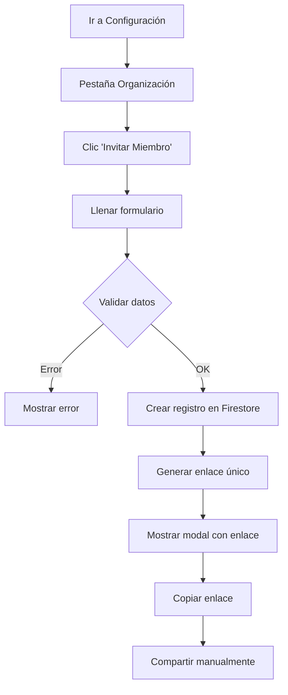

# Sistema de Invitaciones por Enlaces Únicos

## 📋 Resumen del Sistema

El sistema de invitaciones permite a los propietarios de organizaciones invitar nuevos miembros mediante enlaces únicos que se pueden compartir manualmente. Este enfoque es simple, seguro y no requiere configuración de email.

## 🏗️ Arquitectura del Sistema

### Componentes Principales

```
┌─────────────────────────────────────────────────────────────┐
│                    FLUJO DE INVITACIONES                    │
├─────────────────────────────────────────────────────────────┤
│                                                             │
│  1. OrganizationManager.tsx                                 │
│     ├─ Crear invitación                                     │
│     ├─ Generar enlace único                                 │
│     └─ Modal con enlace para compartir                      │
│                                                             │
│  2. useOrganization.ts (Hook)                               │
│     ├─ addMember() → Crear registro en Firestore           │
│     ├─ Generar URL: /invite/[uniqueId]                      │
│     └─ Retornar enlace para compartir                       │
│                                                             │
│  3. /invite/[inviteId]/page.tsx                             │
│     ├─ Validar enlace (existe, no expirado, pending)       │
│     ├─ Verificar usuario autenticado                        │
│     ├─ Verificar email coincide                             │
│     └─ Procesar aceptación/rechazo                          │
│                                                             │
│  4. PendingInvites.tsx                                      │
│     ├─ Mostrar invitaciones pendientes                      │
│     ├─ Auto-detectar por email del usuario                  │
│     └─ Permitir aceptar/rechazar desde config               │
│                                                             │
└─────────────────────────────────────────────────────────────┘
```

### Base de Datos (Firestore)

#### Colección: `organizations`
```javascript
{
  id: "org_abc123",
  name: "Mi Empresa",
  description: "Descripción de la empresa",
  ownerId: "user_xyz789",
  memberIds: ["user_xyz789", "user_def456"],
  createdAt: "2024-01-15T10:30:00.000Z",
  updatedAt: "2024-01-15T10:30:00.000Z",
  settings: {
    allowMemberInvites: true,
    defaultLeadStage: "Nuevo",
    timezone: "America/Mexico_City"
  }
}
```

#### Colección: `organizationInvites`
```javascript
{
  id: "invite_unique123",
  organizationId: "org_abc123",
  email: "nuevo@ejemplo.com",
  role: "member", // "admin" | "member"
  invitedBy: "user_xyz789",
  invitedByEmail: "propietario@ejemplo.com",
  createdAt: "2024-01-15T10:30:00.000Z",
  expiresAt: "2024-01-22T10:30:00.000Z", // 7 días después
  status: "pending" // "pending" | "accepted" | "declined" | "expired"
}
```

## 🔄 Flujo Detallado del Usuario

### 1. Crear Invitación (Propietario)



**Código clave:**
```typescript
// En useOrganization.ts
const addMember = async (orgId: string, email: string, role: 'admin' | 'member') => {
  const inviteData = {
    organizationId: orgId,
    email: email.trim().toLowerCase(),
    role,
    invitedBy: user.uid,
    invitedByEmail: user.email,
    createdAt: serverTimestamp(),
    expiresAt: new Date(Date.now() + 7 * 24 * 60 * 60 * 1000), // 7 días
    status: 'pending' as const
  };

  const inviteRef = await addDoc(collection(db, 'organizationInvites'), inviteData);
  const baseUrl = window.location.origin;
  const inviteLink = `${baseUrl}/invite/${inviteRef.id}`;
  
  return { inviteId: inviteRef.id, inviteLink, success: true };
};
```

### 2. Aceptar Invitación (Invitado)

```mermaid
graph TD
    A[Recibir enlace] --> B[Hacer clic en enlace]
    B --> C[Cargar página /invite/[id]]
    C --> D{Enlace válido?}
    D -->|No| E[Mostrar error]
    D -->|Sí| F{Usuario autenticado?}
    F -->|No| G[Mostrar botón 'Iniciar Sesión']
    F -->|Sí| H{Email coincide?}
    H -->|No| I[Mostrar aviso cambiar cuenta]
    H -->|Sí| J[Mostrar botones Aceptar/Rechazar]
    J --> K[Clic Aceptar]
    K --> L[Actualizar invite status]
    L --> M[Agregar user a organización]
    M --> N[Redirigir a dashboard]
```

**Validaciones implementadas:**
```typescript
// En /invite/[inviteId]/page.tsx
const loadInvite = async () => {
  const inviteDoc = await getDoc(inviteRef);
  
  // 1. Verificar que existe
  if (!inviteDoc.exists()) {
    setError('Invitación no encontrada o ya no es válida.');
    return;
  }
  
  // 2. Verificar que no ha expirado
  if (new Date(inviteData.expiresAt) < new Date()) {
    setError('Esta invitación ha expirado.');
    return;
  }
  
  // 3. Verificar que está pendiente
  if (inviteData.status !== 'pending') {
    setError('Esta invitación ya ha sido utilizada.');
    return;
  }
};
```

### 3. Estados de la Invitación

| Estado | Descripción | Acciones Disponibles |
|--------|-------------|---------------------|
| `pending` | Invitación creada, esperando respuesta | Aceptar, Rechazar |
| `accepted` | Usuario aceptó y se unió a la organización | Solo ver historial |
| `declined` | Usuario rechazó la invitación | Solo ver historial |
| `expired` | Invitación expiró (>7 días) | Solo ver historial |

## 🔒 Seguridad y Validaciones

### Reglas de Firestore
```javascript
// En firestore.rules
match /organizationInvites/{inviteId} {
  // Solo el usuario con el email de la invitación puede leerla
  allow read: if request.auth != null && 
    request.auth.token.email == resource.data.email;
  
  // Solo miembros de la organización pueden crear invitaciones
  allow create: if request.auth != null && 
    request.auth.uid == request.resource.data.invitedBy;
  
  // Solo el usuario invitado puede actualizar (aceptar/rechazar)
  allow update: if request.auth != null && 
    request.auth.token.email == resource.data.email;
}
```

### Validaciones en Cliente
1. **Email exacto**: Debe coincidir el email del usuario autenticado con el de la invitación
2. **Expiración**: Enlaces expiran automáticamente en 7 días
3. **Uso único**: Una vez aceptada/rechazada, no se puede volver a usar
4. **Autenticación**: Requiere usuario autenticado para procesar

### Medidas de Seguridad
- ✅ **IDs únicos**: Cada invitación tiene un ID único irrepetible
- ✅ **Validación de email**: Solo el email exacto puede aceptar
- ✅ **Expiración automática**: Sin enlaces perpetuos
- ✅ **Estado inmutable**: No se puede reutilizar invitaciones
- ✅ **Permisos granulares**: Reglas de Firestore restrictivas

## 🎯 Casos de Uso y Escenarios

### Escenario 1: Flujo Exitoso
```
1. Ana (propietario) invita a Bruno (bruno@empresa.com)
2. Sistema genera: https://app.com/invite/abc123
3. Ana envía enlace por WhatsApp
4. Bruno hace clic → Ve página de invitación
5. Bruno inicia sesión con bruno@empresa.com
6. Bruno acepta → Se une automáticamente
7. Bruno ve dashboard con datos de la organización
```

### Escenario 2: Email Incorrecto
```
1. Ana invita a bruno@empresa.com
2. Carlos (carlos@otra.com) hace clic en el enlace
3. Sistema detecta email no coincide
4. Muestra mensaje: "Esta invitación es para bruno@empresa.com"
5. Ofrece opción de cambiar cuenta
```

### Escenario 3: Usuario Sin Cuenta
```
1. Ana invita a diana@nueva.com
2. Diana hace clic pero no tiene cuenta
3. Sistema detecta no autenticado
4. Muestra botón "Iniciar Sesión"
5. Diana se registra con diana@nueva.com
6. Diana regresa al enlace → Puede aceptar
```

### Escenario 4: Enlace Expirado
```
1. Ana invita a elena@test.com
2. Pasan 8 días sin respuesta
3. Elena hace clic en enlace
4. Sistema detecta expiración
5. Muestra mensaje de enlace expirado
6. Elena debe solicitar nueva invitación
```

## 🚀 Ventajas del Sistema

### ✅ Simplicidad
- **Sin configuración**: No requiere SMTP, SendGrid, etc.
- **Sin dependencias**: Funciona con Firestore únicamente
- **Fácil deployment**: No configuraciones adicionales

### ✅ Seguridad
- **Enlaces únicos**: Cada invitación es irrepetible
- **Validación estricta**: Email exacto requerido
- **Expiración automática**: Sin enlaces perpetuos
- **Permisos granulares**: Firestore rules protegen datos

### ✅ Experiencia de Usuario
- **Flujo claro**: Pasos obvios y bien guiados
- **Feedback visual**: Estados claros en cada paso
- **Responsive**: Funciona en móvil y desktop
- **Multiidioma**: Preparado para internacionalización

### ✅ Flexibilidad
- **Múltiples métodos**: WhatsApp, email, Slack, etc.
- **Sin restricciones**: El propietario elige cómo compartir
- **Diferentes roles**: Admin y Member desde el inicio

## ⚠️ Limitaciones y Consideraciones

### Limitaciones Actuales
1. **No hay emails automáticos**: Requiere compartir manualmente
2. **No hay recordatorios**: No notifica sobre invitaciones pendientes
3. **No hay bulk invites**: Una invitación a la vez
4. **No hay analytics**: No se trackea efectividad de invitaciones

### Consideraciones de UX
1. **Educación del usuario**: Explicar bien cómo compartir enlaces
2. **Seguimiento manual**: El propietario debe hacer follow-up
3. **Enlaces largos**: URLs pueden ser difíciles de compartir en algunos contextos

### Mejoras Futuras Recomendadas
1. **QR Codes**: Generar códigos QR para facilitar compartir
2. **Códigos cortos**: Sistema de códigos de 6 dígitos
3. **Templates de mensaje**: Mensajes predefinidos para compartir
4. **Dashboard de invitaciones**: Ver estado de todas las invitaciones
5. **Notificaciones push**: Alertar sobre invitaciones pendientes

## 🧪 Testing y Validación

### Tests Manuales Recomendados

#### Test 1: Flujo Completo Exitoso
1. Crear organización
2. Invitar miembro con email válido
3. Copiar enlace generado
4. Abrir enlace en ventana incógnita
5. Registrarse/iniciar sesión con email correcto
6. Aceptar invitación
7. Verificar aparición en organización

#### Test 2: Validaciones de Seguridad
1. Intentar acceder con email diferente → Debe fallar
2. Esperar expiración (o cambiar fecha) → Debe fallar
3. Aceptar invitación y volver a usar enlace → Debe fallar
4. Intentar acceder sin autenticar → Debe redirigir

#### Test 3: Edge Cases
1. Enlace inválido/no existente → Error 404
2. Usuario ya miembro de la organización → Manejo apropiado
3. Organización eliminada → Error apropiado
4. Múltiples invitaciones al mismo email → Última válida

### Métricas de Éxito
- ✅ **Tasa de aceptación**: % de invitaciones aceptadas vs enviadas
- ✅ **Tiempo de aceptación**: Tiempo promedio entre envío y aceptación
- ✅ **Errores de validación**: % de intentos fallidos por validaciones
- ✅ **Abandono en flujo**: Dónde se abandonan más las invitaciones

## 📈 Monitoreo y Logs

### Eventos Importantes a Trackear
```typescript
// Eventos de analytics recomendados
track('invitation_created', {
  organizationId: string,
  invitedEmail: string,
  role: 'admin' | 'member',
  invitedBy: string
});

track('invitation_link_clicked', {
  inviteId: string,
  userAgent: string,
  referrer: string
});

track('invitation_accepted', {
  inviteId: string,
  organizationId: string,
  acceptedBy: string,
  timeToAccept: number // en horas
});

track('invitation_declined', {
  inviteId: string,
  reason?: string
});
```

### Logs en Consola Actuales
El sistema ya incluye logs detallados:
```typescript
console.log('🏗️ Creating new organization:', { name, description });
console.log('👥 Adding member to organization:', { orgId, email, role });
console.log('🔗 Invitation link generated:', inviteLink);
console.log('✅ Invite created with ID:', inviteRef.id);
```

## 🔧 Mantenimiento

### Tareas Periódicas Recomendadas
1. **Limpiar invitaciones expiradas**: Job semanal para eliminar invites > 30 días
2. **Monitorear uso**: Revisar métricas de aceptación mensualmente  
3. **Actualizar URLs**: Verificar que dominios en enlaces sean correctos
4. **Revisar seguridad**: Auditar reglas de Firestore trimestralmente

### Backup y Recovery
- **Invitaciones**: Incluir en backups regulares de Firestore
- **Estados**: Documentar estados para recovery manual si es necesario
- **Enlaces activos**: Mantener lista de invitaciones pendientes críticas

---

## 🎉 Conclusión

El sistema de invitaciones por enlaces únicos proporciona una solución **simple, segura y efectiva** para colaboración en equipos. Aunque requiere compartir manual, esto da **flexibilidad total** al propietario para elegir el canal más apropiado.

**Estado actual**: ✅ **Completamente funcional y listo para producción**

**Próximos pasos recomendados**:
1. Probar flujo completo con usuarios reales
2. Implementar analytics básicos  
3. Considerar mejoras de UX según feedback
4. Documentar procedimientos de soporte

**Tiempo estimado de implementación**: ✅ **Completado** (3-4 horas de desarrollo)

**Complejidad de mantenimiento**: 🟢 **Baja** (sin dependencias externas)